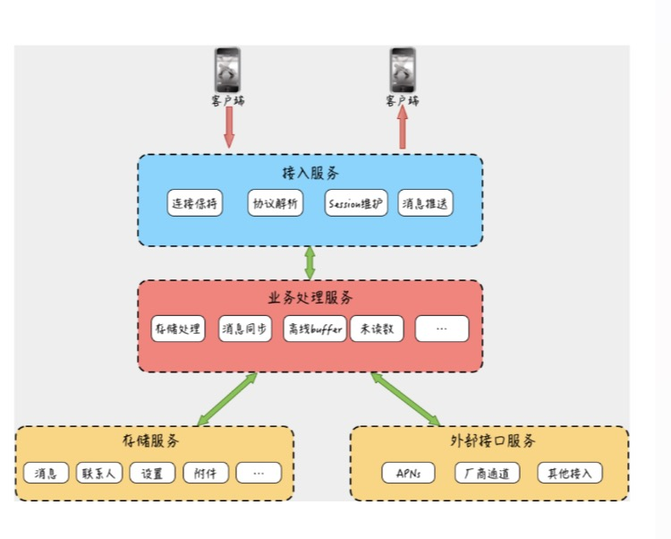

1. 基本架构  
   

2. 组成部分
   - 客户端  
     可以是app等终端，用来收发消息。

   - 接入层  
     服务端的门户，负责长连接的维护、协议解析、session维护、消息推送。其中session的作用是标识`哪个用户在哪个连接`

   - 业务层  
     整个IM的中枢大脑，负责具体的业务处理，比如消息的存储、转发等

   - 存储层  
     用户的账号、关系网络、消息本身都需要持久化存储

   - 外部接口服务  
     比如大部分App在进程长时间后台运行时，App和IM服务器的连接会被断开，当有新消息发生时，无法通过IM服务再触达用户，降低体验。  
     可以将消息推送给第三方服务，比如苹果手机上APNs或者google的GCM。因为GCM国内用不了，可以使用各大手机厂商提供的SDK

3. 接入层和业务层独立拆分的好处
  - 接入层需要保证稳定和高可用，业务层变更&发布比较频繁
  - 有助于提升业务开发效率

4. IM系统的特点
  - 实时性

  - 可靠性
    - 消息不能丢
    - 消息不能重复

  - 一致性  
    多人多终端上消息展示的顺序要一致

  - 安全性

5. 消息存储格式  
   5.1 点对点  
   消息表：消息id、内容、类型、时间  
   索引表：用户uid、另一方uid、消息id、收发类型  
   一条消息再索引表会存在两条记录
